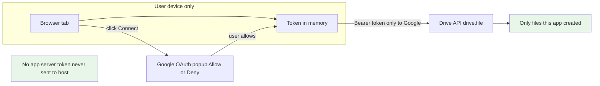
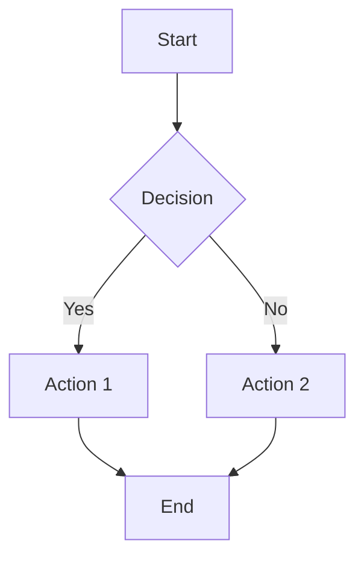

# Markdown Editor Pro

A fully-featured, modern Markdown editor with live preview, auto-save, and fullscreen editing built with HTML, CSS, and JavaScript.

## System reference (recommended)

See **`docs/SYSTEM.md`** for the **current** architecture, invariants, storage model, scroll-sync design, and the offline/deployment checklist.

## Features

### Core Functionality
- **Real-time Preview**: See your markdown rendered as you type
- **Split Pane Layout**: Editor and preview side-by-side with resizable divider
- **IndexedDB Storage**: Large-capacity browser storage (50MB - several GB) for multiple files
- **File Browser**: Browse and manage all your saved files with a beautiful modal interface
- **Auto-Save**: Your work is automatically saved to IndexedDB as you type (never lose data again!)
- **File Persistence**: Resume exactly where you left off across browser sessions
- **Fullscreen Editing**: Distraction-free editing mode with smooth transitions
- **Syntax Highlighting**: Code blocks are highlighted using highlight.js
- **File Operations**: New, Open, and Save markdown files with smart workflow
- **Word Document Import**: Import and convert Word documents (.docx) to Markdown automatically
- **Drag & Drop Support**: Drop markdown files or Word documents onto either the editor or preview pane
- **Image Paste Support**: Paste images from clipboard as embedded inline images
- **Image Widget System**: Collapse long data URLs into moveable image objects
- **Mermaid Diagrams**: Full support for Mermaid flowcharts, sequence diagrams, and more -- with a dedicated diagram viewer (zoom, pan, copy SVG)
- **KaTeX Math Rendering**: Inline and block LaTeX math formulas
- **Minimap Navigation**: Sublime-style minimap for both editor and preview panes

### Editor Features
- **Format Toolbar**: Quick access to common markdown formatting
- **Keyboard Shortcuts**:
  - `Ctrl/Cmd + N`: New file
  - `Ctrl/Cmd + O`: Open file
  - `Ctrl/Cmd + S`: Save file (download)
  - `Ctrl/Cmd + E`: Export to PDF
  - `Ctrl/Cmd + P`: Print
  - `Ctrl/Cmd + B`: Bold text
  - `Ctrl/Cmd + I`: Italic text
  - `Ctrl/Cmd + Z`: Undo (native browser)
  - `Ctrl/Cmd + Y` / `Ctrl/Cmd + Shift + Z`: Redo (native browser)
  - `Escape`: Exit fullscreen mode or close settings modal
  - `Tab`: Indent text
  - `Shift + Tab`: Unindent text
- **Auto-completion**: Automatic closing of brackets, quotes, and parentheses
- **Smart Indentation**: Proper tab handling for code blocks and lists
- **Line Numbers & Statistics**: Real-time word count, character count, and line count
- **Cursor Position**: Shows current line and column

### UI/UX Features
- **Dark/Light Theme**: Toggle between themes with persistent preference
- **View Mode Persistence**: Editor/preview mode preferences saved across sessions
- **Fullscreen Mode**: Click the eye button for immersive editing with mode switching
- **Smooth Transitions**: All UI changes are beautifully animated
- **Responsive Design**: Works on desktop, tablet, and mobile devices
- **Modern Interface**: Clean, professional design with intuitive controls
- **Smart Notifications**: Toast notifications for all operations (saves, loads, errors)
- **Visual Feedback**: Drag-over effects, image processing indicators, and auto-save status
- **Embedded Images**: Pasted images are converted to data URLs for self-contained documents
- **Image Widgets**: Collapsible image objects that can be moved, deleted, and expanded
- **Dual View Modes**: Switch between widget view and raw markdown view
- **Copy HTML**: Export rendered HTML to clipboard
- **Print Support**: Optimized print styles for preview content
- **Storage Management**: Monitor storage usage and export/import data

### Advanced Features
- **Scroll Synchronization**: Preview scrolls with editor (wrap-aware, one-way: editor drives preview)
- **Minimap**: Sublime-style canvas minimap on both editor and preview panes -- click or drag to navigate
- **Mermaid Diagrams**: Full support for flowcharts, sequence diagrams, Gantt charts, and more
- **Mermaid Diagram Viewer**: Click any diagram to open a viewer with zoom, pan, and copy SVG
- **KaTeX Math**: Inline math with `$...$` and block math with `$$...$$`
- **Advanced Error Handling**: Robust Mermaid parsing with helpful error messages
- **Format Buttons**: Quick formatting for:
  - Headers (H1, H2, H3)
  - Bold, Italic, Code
  - Lists (Bullet, Numbered)
  - Quotes, Links, Images
  - Tables
  - Mermaid Diagrams
- **GitHub Flavored Markdown**: Full GFM support including tables and code blocks
- **Accessibility**: Keyboard navigation and screen reader support

## Usage

### Getting Started
1. **Open the Editor**: Open `index.html` in any modern web browser
2. **Start Writing**: Begin typing markdown in the left pane
3. **Auto-Save**: Your work is automatically saved to **IndexedDB** (debounced)
4. **Live Preview**: See the rendered output in the right pane
5. **Fullscreen Mode**: Click the eye button for distraction-free editing

### File Operations
- **New File**: Use `Ctrl/Cmd+N` - Shows dialog with options: Save on Browser (default), Download, Cancel, or Delete
- **Open Files**: Use `Ctrl/Cmd+O` - Opens file browser to select from saved files, or open from disk
- **File Browser**: Browse all saved files, search by name, view metadata, and manage files
- **Save to Computer**: Use `Ctrl/Cmd+S` to download your markdown file
- **Save to Browser**: Files are automatically saved to IndexedDB

### Advanced Features
- **Drag & Drop**: Drag markdown files or Word documents onto the editor or preview pane
- **Word Import**: Click the Word import button or drag & drop `.docx` files for automatic conversion
- **Paste Images**: Copy any image and paste (`Ctrl/Cmd+V`) directly into the editor
- **Mermaid Diagrams**: Create diagrams with code blocks tagged `` ```mermaid ``
- **Math**: Use `$...$` for inline math, `$$...$$` for block math (KaTeX)
- **Minimap**: Click or drag the minimap on either pane to navigate quickly
- **Diagram Viewer**: Click any Mermaid diagram in the preview to zoom/pan or copy SVG

## File Structure

```
MarkdownViewer-web-pro/
├── index.html                    # Main HTML file
├── css/                          # Modular CSS files
│   ├── base.css                  # Base styles and layout
│   ├── buttons.css               # Button styling
│   ├── editor.css                # Editor pane styles
│   ├── modals.css                # Modal dialogs
│   ├── preview.css               # Preview pane styles
│   ├── responsive.css            # Mobile responsiveness
│   ├── toolbar.css               # Toolbar styling
│   └── variables.css             # CSS custom properties
├── js/                           # Modular JavaScript files
│   ├── app.js                    # Application initialization
│   ├── core.js                   # Core editor functionality and scroll sync
│   ├── events.js                 # Event and keyboard shortcut handling
│   ├── file-operations.js        # File open/save operations
│   ├── file-browser.js           # File browser modal interface
│   ├── indexeddb-manager.js      # IndexedDB storage management
│   ├── storage-manager.js        # localStorage management (compatibility)
│   ├── drag-drop.js              # Drag & drop functionality
│   ├── image-paste.js            # Image paste handling
│   ├── minimap.js                # Sublime-style minimap for editor and preview
│   ├── notifications.js          # Toast notifications
│   ├── pane-resizer.js           # Split pane resizing
│   ├── syntax-highlight.js       # Editor syntax highlighting overlay
│   └── simple-image-collapse-v2.js # Image widget system
├── lib/                          # Vendored third-party libraries (all offline)
│   ├── markdown-it.min.js        # Primary Markdown renderer
│   ├── marked.min.js             # Legacy/auxiliary Markdown parser
│   ├── highlight.min.js          # Syntax highlighting
│   ├── highlight.min.css         # Syntax highlighting styles
│   ├── mermaid.min.js            # Mermaid diagram rendering
│   ├── katex.min.js              # KaTeX math rendering
│   ├── katex.min.css             # KaTeX styles
│   ├── katex-auto-render.min.js  # KaTeX auto-render extension
│   ├── mammoth.min.js            # Word document conversion
│   └── fonts/                    # Bundled fonts (KaTeX, etc.)
├── docs/                         # Documentation
│   ├── SYSTEM.md                 # Architecture and invariants reference
│   ├── LOCALSTORAGE.md           # localStorage implementation (legacy)
│   └── ...                       # Other design and feature docs
├── test/                         # Test files
│   └── test-mermaid.md           # Sample/test markdown files
├── archive/                      # Archived old versions
├── build.sh                      # Build script
├── check-deployment.sh           # Deployment validation script
└── build-info.js                 # Build metadata
```

## Dependencies

All dependencies are vendored locally for offline functionality (in `lib/`):

- **markdown-it**: Primary Markdown renderer with source line tracking for scroll sync
- **Marked.js**: Legacy/auxiliary parser (kept vendored, not the primary renderer)
- **Highlight.js**: Syntax highlighting for code blocks
- **Mermaid.js**: Diagram and flowchart rendering
- **KaTeX**: LaTeX math formula rendering
- **Mammoth.js**: Word document to HTML/Markdown conversion

### Hard project rule: NO external runtime dependencies

- **No CDNs**: Do not load runtime JS/CSS/fonts from `http(s)://` (no `<script src="https://...">`, `<link href="https://...">`, or CSS `@import url(https://...)`).
- **Vendored libraries only**: Any third-party runtime dependency must be committed into this repo under `lib/` and referenced via relative paths.
- **Offline-first**: The app must run locally with **zero network access**.

This is enforced by `check-deployment.sh` (it fails if any external runtime assets are detected).

## Browser Support

- Chrome/Chromium (recommended)
- Firefox
- Safari
- Edge
- Any modern browser with ES6+ support

## Keyboard Shortcuts Reference

| Shortcut | Action |
|----------|--------|
| `Ctrl/Cmd + N` | New file (offers to save current work) |
| `Ctrl/Cmd + O` | Open file |
| `Ctrl/Cmd + S` | Save file (download) |
| `Ctrl/Cmd + E` | Export to PDF |
| `Ctrl/Cmd + P` | Print |
| `Ctrl/Cmd + B` | Bold selected text |
| `Ctrl/Cmd + I` | Italic selected text |
| `Ctrl/Cmd + Z` | Undo (native browser) |
| `Ctrl/Cmd + Y` / `Ctrl/Cmd + Shift + Z` | Redo (native browser) |
| `Escape` | Exit fullscreen mode or close settings modal |
| `Tab` | Indent line/selection |
| `Shift + Tab` | Unindent line/selection |

## IndexedDB Storage System

This editor uses IndexedDB as its primary storage, providing much larger capacity than localStorage:

### What's Saved Automatically
- **File Content**: Your markdown text as you type (with full image data URLs)
- **Cursor Position**: Exact position for seamless resume
- **File Name**: Document title and metadata
- **Modified State**: Track unsaved changes
- **File Metadata**: Creation date, modification date, file size, word count, line count

### How It Works
1. **Auto-Save**: Saves to IndexedDB every ~1 second after you stop typing (debounced)
2. **Session Restore**: Automatically loads your most recently modified file when you return
3. **Smart Workflow**: Clear document dialog offers 4 options: Save on Browser (default), Download, Cancel, or Delete
4. **Visual Feedback**: A subtle LED indicator in the footer shows save activity
5. **Migration**: On load, migrates localStorage to IndexedDB non-destructively (does not clear localStorage unless explicitly requested)

### File Management
- **Multiple Files**: Store many files in IndexedDB (50MB - several GB capacity)
- **File Browser**: Beautiful modal interface to browse, search, open, and delete files
- **Search**: Search files by name in the file browser
- **Data Persistence**: Works completely offline, no server required

### Storage Features
- **Large Capacity**: IndexedDB provides 50MB to several GB (vs 5-10MB for localStorage)
- **Error Handling**: Graceful handling of storage quota limits
- **Backward Compatible**: Falls back to localStorage if IndexedDB is unavailable
- **Backup/Restore**: Export a full JSON backup (files + images) from the Settings modal and restore it later

### Important Note About Syncing
IndexedDB data does **NOT** automatically sync across devices. Each browser/device maintains its own copy. Use the download feature or export backup to transfer files.

## Google Drive (optional)

> **Attention (hosts):** To use Drive, you must register the app once in [Google Cloud Console](https://console.cloud.google.com/apis/credentials) and set `DRIVE_CLIENT_ID` in `js/drive-auth.js`. End users only see Google’s “Allow this app?” screen.

You can connect Google Drive to save and open `.md` files in a **Markdown-pro** folder (with subfolders). The app uses Google Identity Services (GIS) in the browser; there is no backend.

### Register the app (host only)

1. Open [Google Cloud Console – Credentials](https://console.cloud.google.com/apis/credentials).
2. Create or select a project, enable **Google Drive API**.
3. **Create credentials** → **OAuth client ID** → type **Web application**.
4. Add **Authorized JavaScript origins** (e.g. `https://yourname.github.io` for GitHub Pages, or `http://localhost:3000` for local testing).
5. Copy the **Client ID** into `js/drive-auth.js` as `DRIVE_CLIENT_ID`.

### Public OAuth branding URLs

If you want the Google Auth setup to be public-facing, use these pages in the Google Auth Platform branding settings:

- **Application home page**: `https://markdownpro.eyesondash.com/about.html`
- **Application privacy policy**: `https://markdownpro.eyesondash.com/privacy.html`
- **Application terms of service**: `https://markdownpro.eyesondash.com/terms.html`
- **Support / developer contact**: `ds@sudoall.com`

The Client ID identifies *your app* to Google (not the end user). It is safe to commit in a public repo; do not commit any Client Secret. Anyone hosting their own copy must create their own OAuth client and add their own origin.

### Security and safety (for users)

- **No app server**: The token never leaves the browser to your site; there is no backend to receive it.
- **Minimal scope**: `drive.file` means the app can only access files it created in Drive, not the user’s full Drive.
- **User control**: Google shows “Allow this app?”; the user can deny or revoke access anytime in their Google Account.



If GIS does not load (offline or blocked), the Drive button stays hidden and the app works as before with IndexedDB only.

### Clear Document Dialog
When creating a new file, you'll see a dialog with 4 options:
- **Save on Browser** (default): Saves current file to IndexedDB
- **Download**: Downloads the file to your computer
- **Cancel**: Keeps current document open
- **Delete**: Removes the file from IndexedDB storage

### Migration from localStorage
The editor automatically migrates files from localStorage to IndexedDB on first load:
- **One-Time Migration**: Runs automatically when you first open the editor
- **Smart Deduplication**: Skips files already in IndexedDB (unless localStorage version is newer)
- **Non-Destructive by Default**: localStorage is kept unless you explicitly clear it
- **Manual Cleanup**: Use `migrateToIndexedDB(true)` in the browser console to migrate and clear localStorage

## Minimap

Both the editor and preview panes have a Sublime-style minimap on the right edge:

- **Editor Minimap**: Renders a scaled-down representation of the text in the textarea
- **Preview Minimap**: Scans the rendered DOM and draws proportional blocks for headings, paragraphs, code fences, images, tables, and Mermaid diagrams
- **Navigation**: Click anywhere on the minimap to jump to that position; drag the viewport slider to scroll
- **Theme-Accurate**: Colors match the current light/dark theme

## KaTeX Math Rendering

Use standard LaTeX syntax to embed math in your documents:

- **Inline math**: Wrap expressions in single dollar signs: `$E = mc^2$`
- **Block math**: Wrap expressions in double dollar signs on their own lines:

```
$$
\int_0^\infty e^{-x^2} dx = \frac{\sqrt{\pi}}{2}
$$
```

Math is rendered via KaTeX entirely offline.

## Drag & Drop Feature

The editor supports drag and drop onto both the editor and preview panes:

### How it Works
1. **Drag a File**: Select any supported file (`.md`, `.txt`, `.markdown`, `.docx`) from your file system
2. **Drop on Editor or Preview**: You'll see a visual indicator on the target pane
3. **Smart Handling**: If you have unsaved changes, you'll get a dialog with options to save, replace, or cancel
4. **Automatic Conversion**: Word documents are automatically converted to Markdown during the drop

### Supported File Types
- `.md`, `.markdown` (Markdown files)
- `.txt` (Plain text files)
- `.docx` (Microsoft Word documents - automatically converted to Markdown)

## Image Paste Feature

Paste images directly from your clipboard with automatic embedding:

1. **Copy Image**: Copy any image (screenshots, web images, etc.)
2. **Paste in Editor**: Press `Ctrl/Cmd+V` in the editor
3. **Automatic Processing**: The image is converted to a base64 data URL and embedded as markdown

### Features
- **Data URL Embedding**: Images are self-contained in the document
- **Automatic Naming**: Pasted images get timestamped filenames
- **Multiple Images**: Paste multiple images sequentially
- **Cursor Positioning**: Images are inserted at your current cursor position

## Image Widget System

Long base64 data URLs are collapsed into compact, interactive image widgets to keep the editor readable:

### Widget Features
- **Collapsed Display**: Large data URLs hidden and replaced with thumbnails
- **Drag & Drop**: Move images by dragging widgets to different lines
- **Quick Actions**: Expand to raw markdown or delete with one click
- **Dual View**: Toggle between widget view and raw markdown view

### Widget Controls
- **Expand**: Switch to raw markdown view and select the image data
- **Delete**: Remove the image with a confirmation dialog
- **Toggle**: Switch between raw markdown and widget views

## Word Document Import

Import Microsoft Word documents (.docx) with automatic conversion to Markdown:

### How to Import
1. **Import Button**: Click the Word document import button (W icon) in the toolbar
2. **Drag & Drop**: Drag a `.docx` file onto the editor or preview pane

### Conversion Features
- Headings (H1-H6), bold/italic, lists, links, tables, code blocks, blockquotes
- **Images**: Embedded images converted to base64 data URLs
- **Smart Filename Handling**: Original filename preserved with `.md` extension

### Known Limitations
- Complex formatting (custom styles, advanced layouts) may be simplified
- Some Word-specific features (comments, track changes) are not preserved
- Very large documents may take longer to process

## Mermaid Diagram Support

Full support for Mermaid diagrams with an integrated diagram viewer:

### Supported Diagram Types
- **Flowcharts**: `graph TD`, `graph LR`, `flowchart TD`
- **Sequence Diagrams**: `sequenceDiagram`
- **Gantt Charts**: `gantt`
- **Class Diagrams**: `classDiagram`
- **State Diagrams**: `stateDiagram`
- **Journey Maps**: `journey`
- **Pie Charts**: `pie`
- **Git Graphs**: `gitgraph`
- **Entity Relationship**: `erDiagram`

### Usage
Create a code block tagged `mermaid`:

````

````

### Diagram Viewer
Click any rendered diagram in the preview to open a full-screen viewer with:
- **Zoom**: Scroll or use buttons to zoom in/out
- **Pan**: Click and drag to pan around large diagrams
- **Copy SVG**: Copy the raw SVG to clipboard

## Fullscreen Editing Mode

Click the eye button to enter fullscreen mode:

### Features
- **Mode Switching**: Toggle between edit-only and preview-only modes
- **Smooth Transitions**: Animated mode changes
- **Floating Controls**: Clean interface with floating mode toggle buttons
- **Keyboard Exit**: Press `Escape` to exit fullscreen
- **View Mode Persistence**: Your last used mode is remembered across sessions

### Controls in Fullscreen
- **Edit Mode**: Show only the editor for focused writing
- **Preview Mode**: Show only the preview for reading
- **Exit**: Return to normal dual-pane view (or press `Escape`)

## Markdown Syntax Support

Full GitHub Flavored Markdown including:

- Headers (`#`, `##`, `###`, etc.)
- **Bold** and *italic* text
- `Inline code` and code blocks
- Lists (ordered and unordered)
- Blockquotes
- Links and images
- Tables
- Horizontal rules
- Strikethrough text
- Task lists
- Mermaid diagrams
- LaTeX math (KaTeX)

## Customization

The editor uses CSS custom properties for easy theming. Edit `css/variables.css` to change the color scheme.

### Modular Architecture
- **CSS Modules**: Separate files for different components
- **JavaScript Modules**: Clean separation of concerns
- **Extensible Design**: Easy to add new features

## Technical Documentation

- **`docs/SYSTEM.md`**: Architecture, invariants, storage model, scroll sync, and deployment checklist (primary reference)
- **`docs/LOCALSTORAGE.md`**: Legacy localStorage implementation notes
- **`test/`**: Test files and debugging tools

## Recent Updates

### Current - Minimap, KaTeX, Diagram Viewer, View Mode Persistence
- **Minimap**: Sublime-style canvas minimap on both editor and preview panes
- **KaTeX Math**: Inline (`$...$`) and block (`$$...$$`) LaTeX math rendering
- **Mermaid Diagram Viewer**: Click any diagram for a full-screen viewer with zoom, pan, and SVG copy
- **View Mode Persistence**: Editor/preview split mode remembered across sessions
- **Drag-Drop on Preview**: Files can be dropped onto the preview pane as well as the editor
- **Internal Anchor Links**: Fixed in-page anchor navigation

### Version 2.0 - IndexedDB & File Browser
- **IndexedDB Storage**: Upgraded from localStorage to IndexedDB (50MB - several GB capacity)
- **File Browser**: Modal interface to browse, search, and manage all saved files
- **Multiple Files**: Store and manage multiple markdown files in browser storage
- **Enhanced Clear Dialog**: New file dialog with 4 options: Save on Browser, Download, Cancel, Delete
- **Scroll Sync**: Wrap-aware one-way scroll synchronization (editor drives preview)
- **markdown-it**: Switched to markdown-it as the primary renderer with source line tracking

## Browser Support

- **Chrome/Chromium**: Full support (recommended)
- **Firefox**: Full support
- **Safari**: Full support
- **Edge**: Full support
- **Mobile Browsers**: Responsive design works on all modern mobile browsers
- **Requirements**: ES6+, IndexedDB, modern CSS features

## Performance

- **Offline-First**: Works completely offline
- **Fast Loading**: All dependencies vendored locally
- **Efficient Storage**: Debounced auto-save prevents performance issues
- **Responsive**: Smooth performance on all device types

## License

This project is open source and available under the MIT License.
