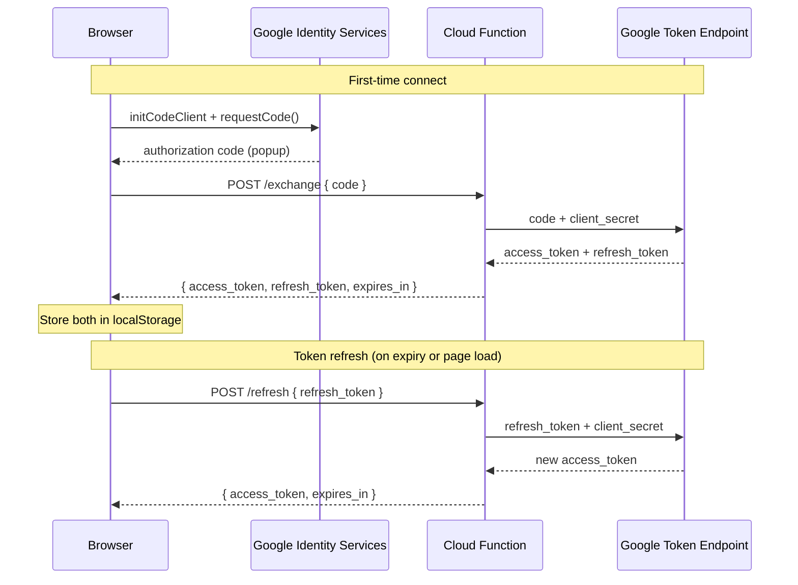

# GCF OAuth Proxy for Persistent Drive Connection

## Architecture

## Why this fixes the disconnection

- **Refresh tokens are permanent** (until user revokes access in Google account settings)
- Token refresh is a plain HTTP POST to the GCF - no dependency on third-party cookies, no dependency on an active Google browser session, no GIS silent popup that browsers increasingly block
- Works across page reloads, tab closures, and browser restarts
- The GCF is stateless (no database) - it just adds `client_secret` to Google's token endpoint calls

## 1. Google Cloud Function (`functions/drive-auth-proxy/`)

A single HTTP Cloud Function (Gen 2, Node.js 20) with two actions:

- **`POST { action: "exchange", code }` ** - exchanges authorization code for access_token + refresh_token via `https://oauth2.googleapis.com/token` using `client_secret` from environment. Uses `redirect_uri: "postmessage"` (GIS popup convention).
- `**POST { action: "refresh", refresh_token }`** - exchanges refresh_token for a new access_token. Returns a new refresh_token if Google rotates it.

Security:

- CORS allowlist: `markdownpro.eyesondash.com`, `davidcarma.github.io`, `localhost:3000/8080`
- `client_secret` stored as a GCF environment variable (or Secret Manager reference)
- Rejects non-POST, missing params, unknown origins

Files to create:

- `functions/drive-auth-proxy/index.js` - ~60 lines, single exported function
- `functions/drive-auth-proxy/package.json` - `@google-cloud/functions-framework` dev dep only
- `scripts/deploy-gcf.sh` - gcloud deploy command with secret env var

## 2. Client-side auth rewrite (`js/drive-auth.js`)

Switch from `initTokenClient` (implicit grant) to `initCodeClient` (authorization code flow):

**Connect flow:**

- `initCodeClient({ client_id, scope, ux_mode: 'popup', callback })` replaces `initTokenClient`
- Callback receives `{ code }`, sends it to GCF `/exchange`
- Stores `access_token`, `refresh_token`, and `expires_at` in localStorage

**Refresh flow (replaces unreliable GIS silent refresh):**

- `refreshToken()` sends stored refresh_token to GCF `/refresh`
- Gets back a fresh access_token - deterministic, no popups, no cookie dependency
- If Google rotates the refresh_token, store the new one

**New localStorage keys:**

- `markdownpro-drive-refresh-token` (the long-lived token)
- Existing keys (`access-token`, `token-expires-at`, `reconnect`, `last-email`) remain

**Backward compatibility:**

- On first load after upgrade, if a user has `markdownpro-drive-reconnect: '1'` but no refresh_token, prompt them to click reconnect once (this time via the code flow, which gives them a refresh_token going forward)

**Keep existing improvements:**

- Visibility/focus handlers (from earlier changes) still trigger immediate refresh on tab reactivation
- Grace period for nominally-expired tokens still applies
- Retry with backoff still applies (though refresh via GCF is much more reliable)

## 3. App integration (`js/app.js`)

Minimal changes to the reconnect flow:

- On page load, if refresh_token exists in localStorage, call `driveAuth.refreshToken()` instead of `silentConnectWithRetry()` - this is now a reliable HTTP call, not a GIS gamble
- Success/failure notification logic stays the same

## 4. GCP project setup (one-time manual steps)

In the existing GCP project (1024951916599):

- **Enable Cloud Functions API** (and Cloud Build, Artifact Registry if not already enabled for Gen 2)
- **Note the client_secret** from the existing OAuth client (Console > APIs & Services > Credentials)
- **Deploy the function** via `scripts/deploy-gcf.sh` passing the secret
- **Add the GCF URL** to `.cursorrules` permitted endpoints

No changes needed to the OAuth client's authorized origins or redirect URIs (GIS code client with `ux_mode: 'popup'` uses `postmessage` internally).

## 5. Project rules update (`.cursorrules`)

Update the cloud integration rules:

- Rule 1 changes from "No backend server, proxy, or cloud function required" to "A stateless Cloud Function may serve as an OAuth token proxy. No other backend logic."
- Add the GCF endpoint to the permitted endpoints table: `https://<region>-<project>.cloudfunctions.net/drive-auth-proxy`

## 6. Cost / limits

- GCF Gen 2 free tier: **2M invocations/month**, 400k GB-seconds compute
- This function runs for ~200ms per call (one outbound HTTP to Google)
- Typical usage: ~2 refreshes/hour per active user = negligible cost
- No database, no KV, no storage costs

## Files changed summary

- **New:** `functions/drive-auth-proxy/index.js`, `functions/drive-auth-proxy/package.json`, `scripts/deploy-gcf.sh`
- **Rewritten:** `[js/drive-auth.js](js/drive-auth.js)` - code flow + GCF refresh replaces implicit grant
- **Updated:** `[js/app.js](js/app.js)` - reconnect uses refresh_token path
- **Updated:** `[.cursorrules](.cursorrules)` - permit the GCF endpoint
- **Updated:** `[GOOGLE_DRIVE_PLAN.md](GOOGLE_DRIVE_PLAN.md)` - document new architecture

