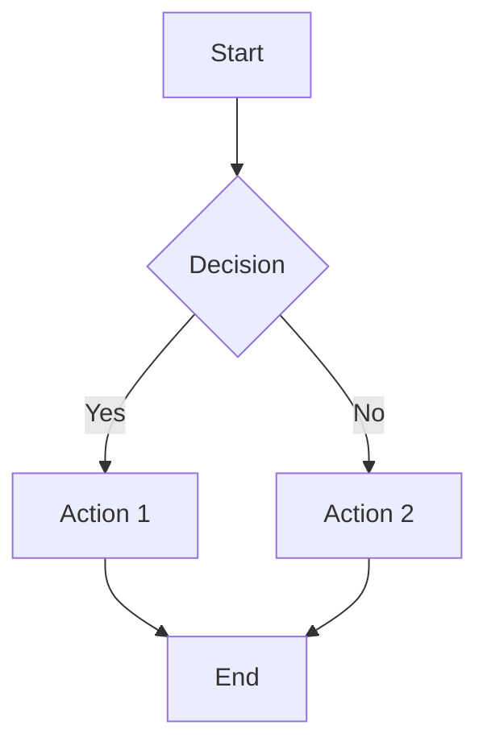
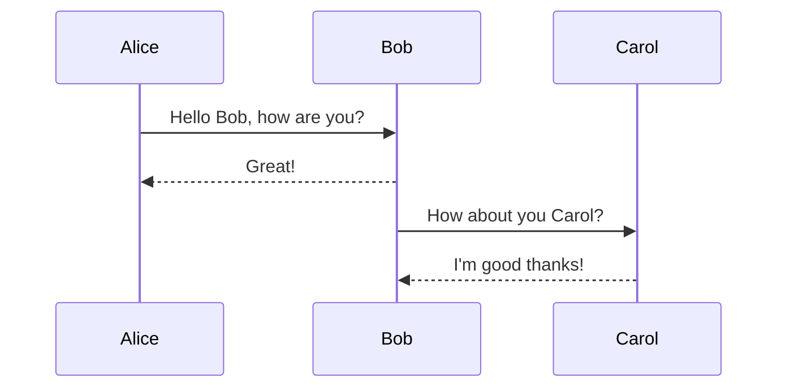
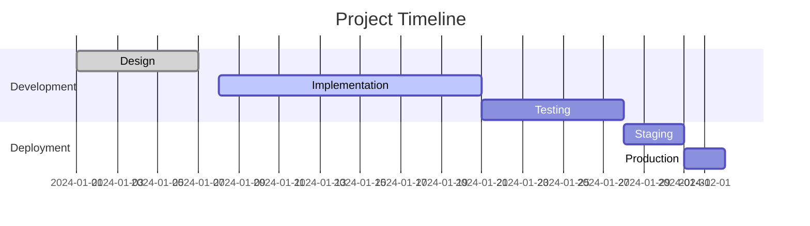

# Mermaid Export Test

This document tests Mermaid diagram export functionality.

## Simple Flowchart



## Sequence Diagram



## Gantt Chart



## Regular Content

This is regular markdown content that should also be exported correctly.

- List item 1
- List item 2
- List item 3

**Bold text** and *italic text* should work fine.

```javascript
// Code blocks should also work
function test() {
    console.log("Testing export functionality");
}
```
