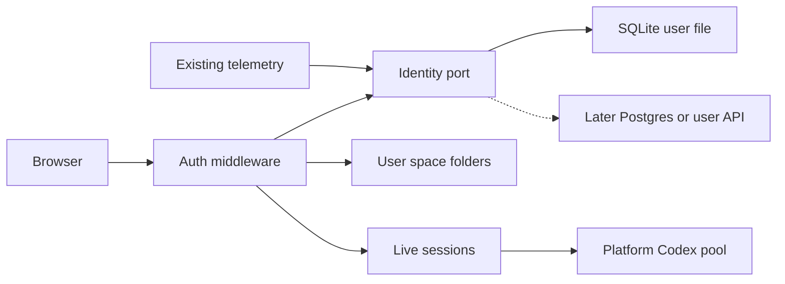
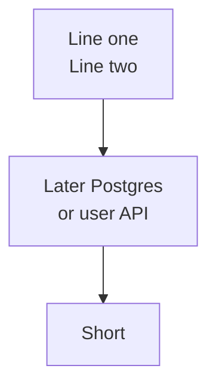

# Mermaid visual QA: identity store flowchart

Primary fixture for Mermaid renderer fixes. Labels must be fully visible
(no top/bottom clip). Viewport height must hug the diagram.

## Multi-line labels (newlines must survive)

