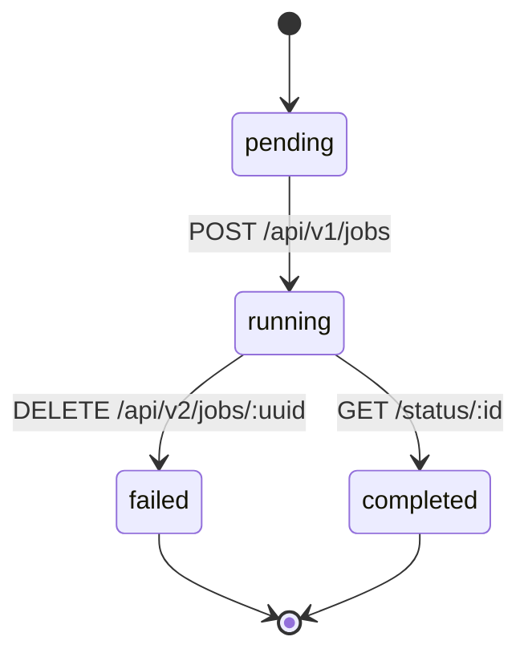
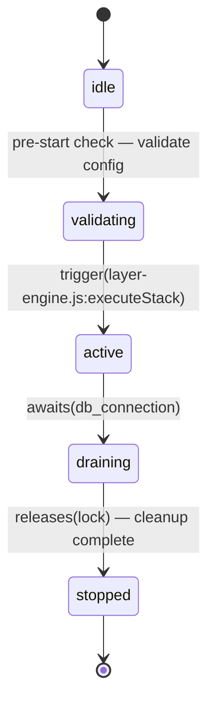
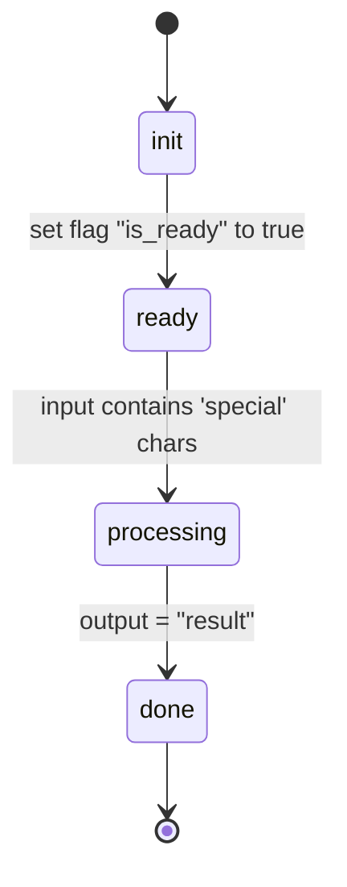
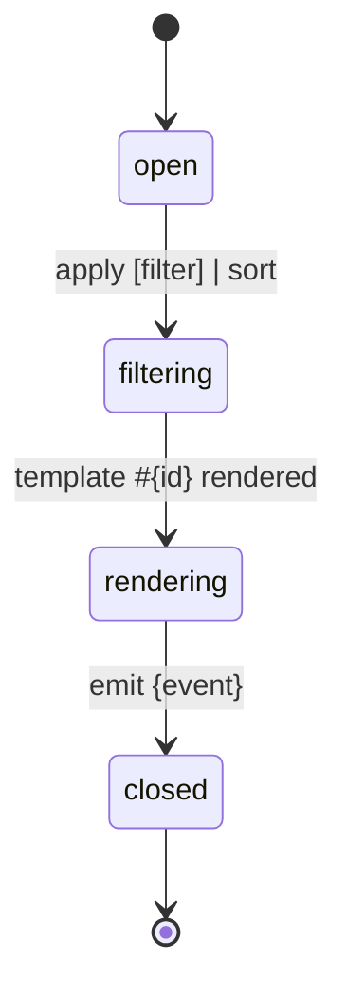
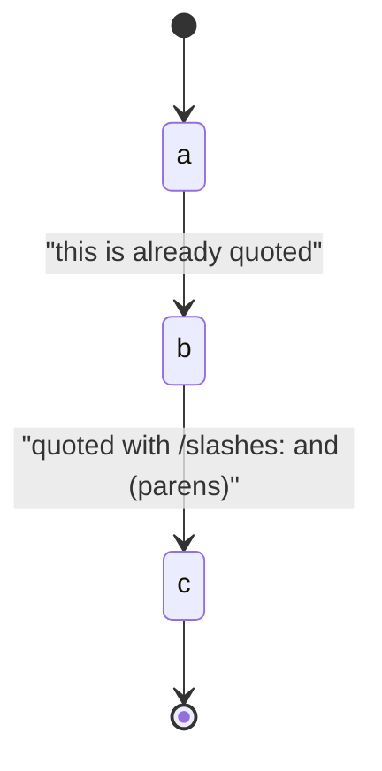
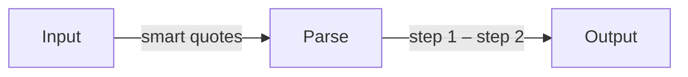
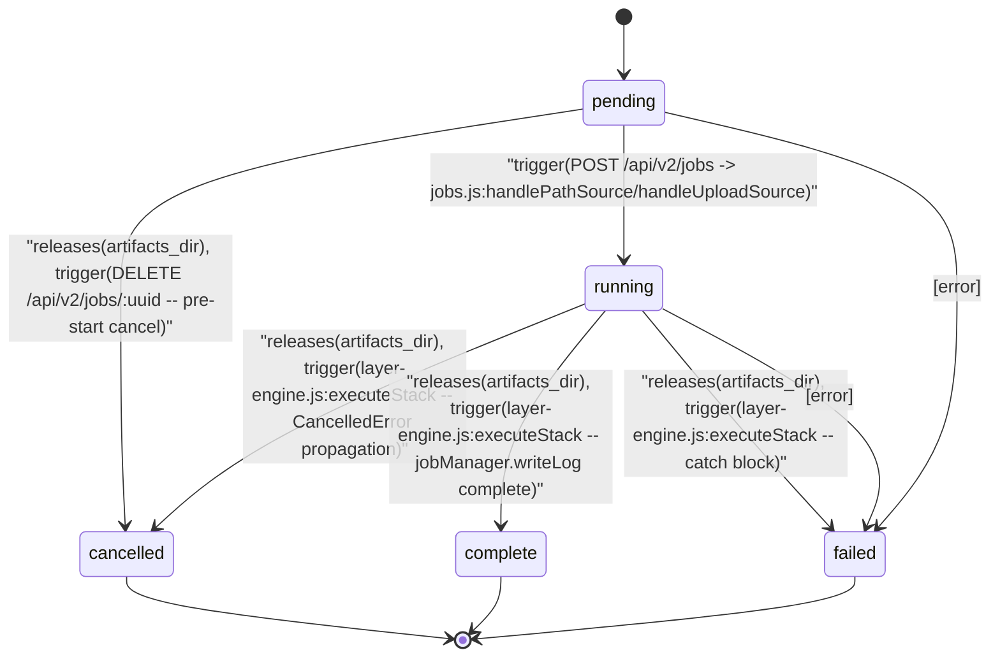
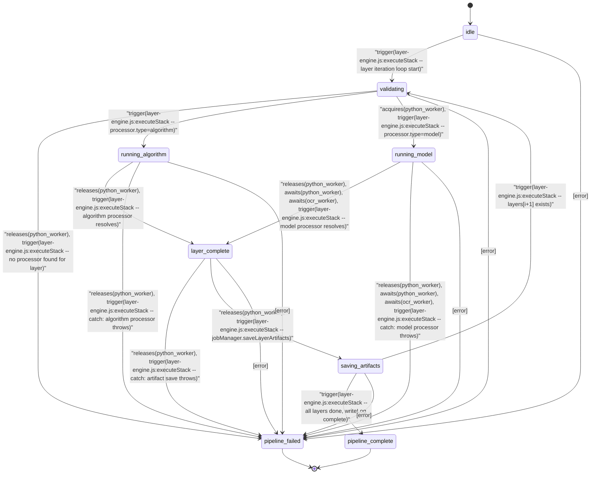
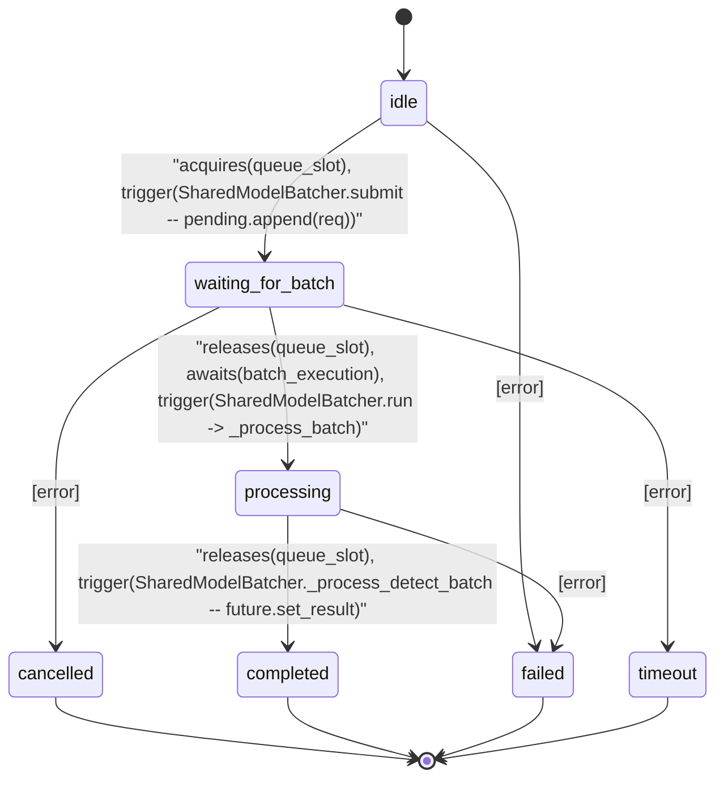

# Mermaid Stress Test — Brittle Label Patterns

These diagrams reproduce the known parse-error patterns that break Mermaid's
parser. Every diagram below should render cleanly after the sanitizer fix.

---

## 1. stateDiagram-v2: Unquoted labels with slashes and colons

The classic failure: API paths like `DELETE /api/v2/jobs/:uuid` in transition labels.



## 2. stateDiagram-v2: Em-dashes, parentheses, and mixed punctuation



## 3. stateDiagram-v2: Embedded quotes in labels



## 4. stateDiagram-v2: Brackets, pipes, hashes, and structural chars



## 5. stateDiagram-v2: Semicolons and backslashes

```mermaid
stateDiagram-v2
    [*] --> start
    start --> middle : cmd1; cmd2; cmd3
    middle --> end : path\to\file
    end --> [*]
```



## 6. stateDiagram-v2: Already-quoted labels (should pass through unchanged)



## 7. Flowchart: Pipe-delimited edge labels with special chars

```mermaid
flowchart LR
    A[Start] -->|POST /api/users| B[Create User]
    B -->|validate(input)| C{Valid?}
    C -->|Yes — proceed| D[Save to DB]
    C -->|No — retry| A
    D -->|emit "saved" event| E[Done]
```

## 8. Flowchart: Node labels with double braces and nested parens

```mermaid
flowchart TD
    A[Config {{defaults}}] --> B[Process (step 1)]
    B --> C[Validate {{schema.v2}}]
    C --> D[Result (final output)]
```

## 9. Flowchart: Curly quotes and Unicode dashes in labels



## 10. EXACT RuleCoder output: job_lifecycle (from EVAL_V0_10_3)

This is the verbatim Mermaid from the production eval doc.



## 11. EXACT RuleCoder output: layer_pipeline (from EVAL_V0_10_3)



## 12. EXACT RuleCoder output: gpu_batcher (from EVAL_V0_10_3)



---

## Expected Results

All 12 diagrams above should render as proper SVG diagrams with no red error
boxes. Labels may have minor character substitutions (e.g., `"` → `'`,
`—` → `-`, `/` → space, `:` → ` -`) but should remain readable.
