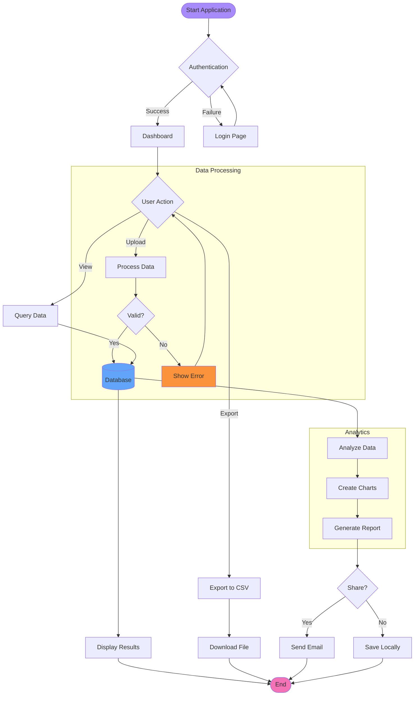
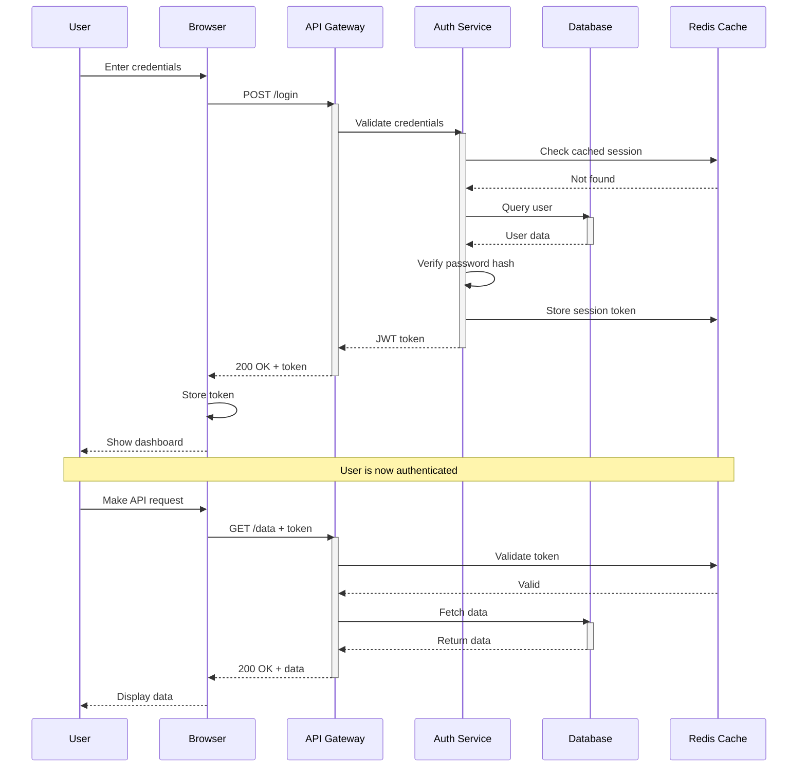
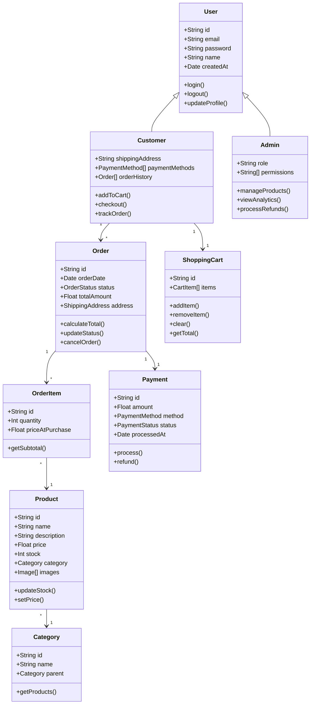
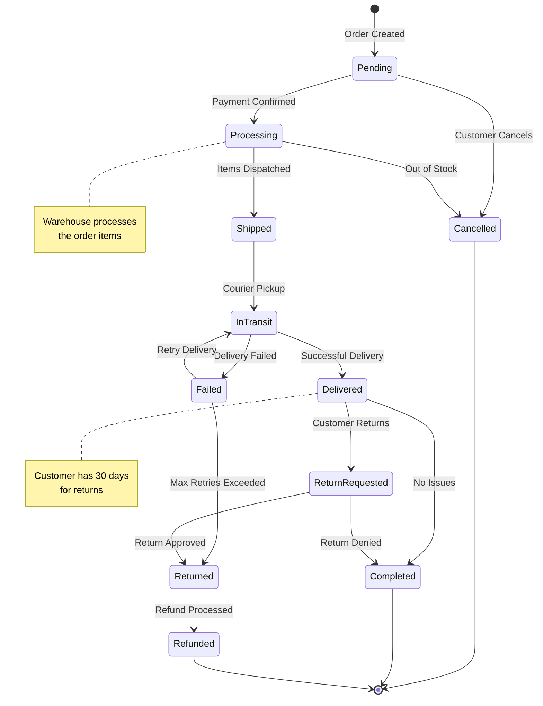
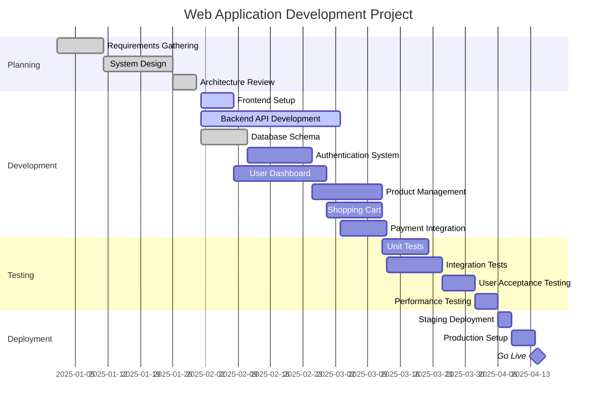
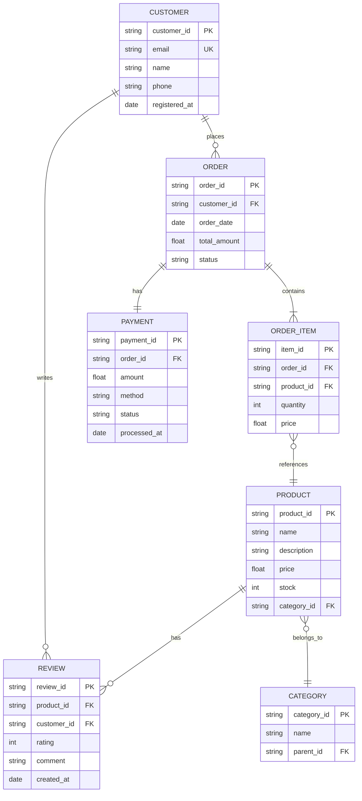
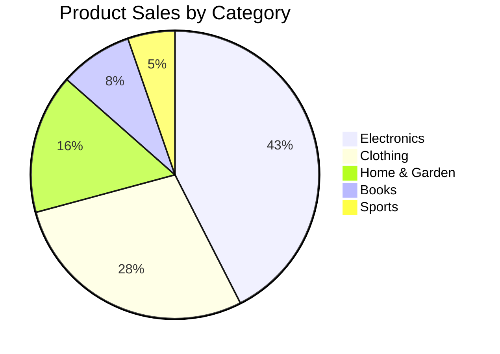
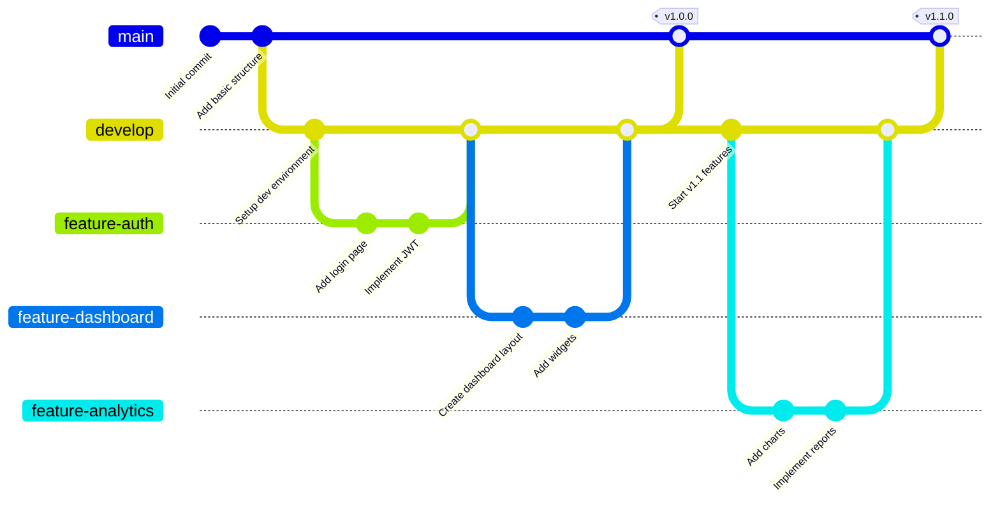
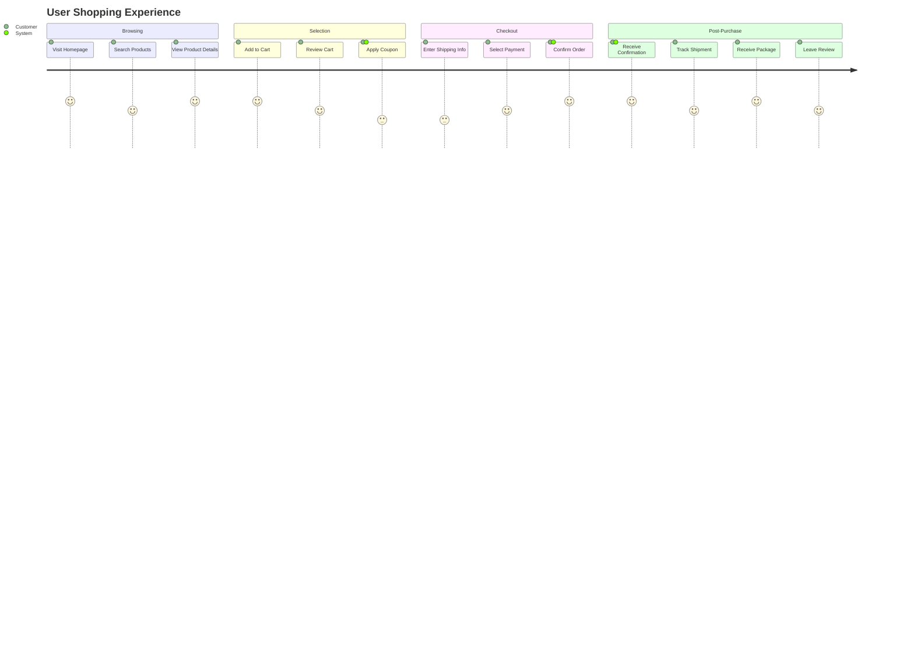

# 🧪 Mermaid Diagram Test Suite

## 1. Complex Flowchart with Subgraphs

## 2. Sequence Diagram - User Authentication

## 3. Class Diagram - E-commerce System

## 4. State Diagram - Order Lifecycle

## 5. Gantt Chart - Project Timeline

## 6. ER Diagram - Database Schema

## 7. Pie Chart - Sales Distribution

## 8. Git Graph - Version Control Flow

## 9. Journey Diagram - User Experience

---

## Testing Checklist

**Verify the following for each diagram:**

- ✅ **Rendering Quality** - All elements visible and properly aligned
- ✅ **Theming** - Colors adapt to light/dark/Gwyneth themes
- ✅ **Responsiveness** - Diagrams scale appropriately
- ✅ **Performance** - No lag or freezing
- ✅ **Export** - Diagrams appear in PDF/print output
- ✅ **Syntax Highlighting** - Code blocks display correctly
- ✅ **Error Handling** - Invalid diagrams show error messages

**Known Diagram Types Tested:**
1. Flowchart (graph TD) with subgraphs and styling
2. Sequence Diagram with multiple participants
3. Class Diagram with inheritance and relationships
4. State Diagram (v2) with transitions and notes
5. Gantt Chart with sections and milestones
6. ER Diagram (Entity Relationship)
7. Pie Chart with percentages
8. Git Graph with branches and merges
9. Journey Diagram with user experience flow

---

**Tips for Testing:**
- Open this file in the Markdown Editor
- Toggle between Edit and Preview modes
- Try all three themes (Light, Dark, Gwyneth)
- Export to PDF and verify diagrams render
- Test with image collapse feature
- Check performance with all diagrams visible

